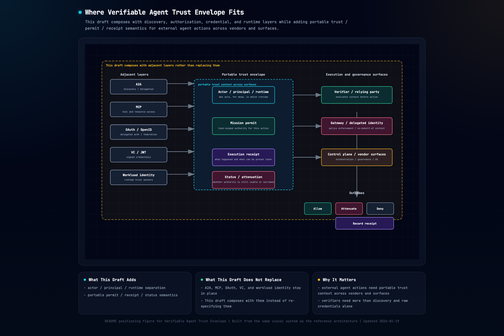

# Verifiable Agent Trust Envelope

[](https://doi.org/10.5281/zenodo.19839769)

**A discussion draft for verifier-side trust / permit / receipt decisions in AI agent systems**

`v0.1 discussion draft`  
`not production-ready`  
`seeking critique on boundary, verifier order, and artifact semantics`

## The Problem

An external agent wants to perform a risky write against a remote system.

In that moment, the relying party often needs more than:

- discovery metadata
- a valid access token
- a stable identity label

It may also need to know:

- which actor is acting
- on whose behalf it acts
- whether the current runtime is fresh and genuine
- what task-scoped authority exists right now
- whether current status has narrowed or revoked that authority
- what receipt should exist after execution

This draft proposes a portable trust envelope for that boundary.
The current repository makes that boundary concrete through a verifier-centered `AL2` HTTP wedge that evaluates:

`status -> identity -> runtime -> permit -> policy`

and returns:

`allow / attenuate / deny`

with a machine-readable admission receipt.



## What This Draft Adds

This draft is intentionally narrow.
It is strongest on the following boundary:

- separating **controller**, **principal**, **actor**, and **runtime**
- modeling **APC**, **ARP**, **AMP**, **AER**, and **ASN** as first-class artifacts
- making verifier-side ordering explicit for external digital write decisions
- treating **status** and **attenuation** as protocol concerns rather than afterthoughts
- separating verifier-signed **admission receipts** from later **post-execution receipts** where later evidence matters

## What This Draft Does Not Replace

This draft is not trying to become:

- an agent platform
- a multi-agent control plane
- an MCP or A2A connector suite
- a gateway or API management product
- a universal identity registry
- a single global issuer

It is meant to compose with adjacent layers such as:

- `A2A` for discovery and delegation flow
- `MCP + OAuth` for tool and resource authorization
- `VC / JWT` for portable signed credentials
- `OpenID Federation / CAEP` for trust federation and status signaling
- `SPIFFE / workload identity / cloud attestation` for runtime authenticity anchors

For the explicit non-goals, see [docs/non-goals.md](docs/non-goals.md).

## Close Adjacent Work

The public work most likely to be read as overlapping is:

- **Agent Permission Protocol (Crittora)**: explicit execution-time permission policy and enforcement gate
- **Open Agent Passport / APort**: passport and decision objects with policy enforcement
- **Agent Passport System (APS / AEOESS)**: broader identity, delegation, governance, and commerce stack
- **AgentROA**: policy enforcement around MCP-routed agent actions
- **Agent Auth / AIP drafts**: identity-first work around agent authentication and trust

This draft should not be presented as if those do not exist.
The intended claim is narrower:

- this repo is a reviewable draft for a specific verifier-side boundary
- its center of gravity is the composite artifact model across identity, runtime proof, task-scoped permit, status, and receipt
- it is not claiming to replace the adjacent standards or product layers above

Direct comparison note:

- [docs/close-adjacent-work-2026-04.md](docs/close-adjacent-work-2026-04.md)

## Read This In 5 Minutes

If you are new to the repo, the fastest path is:

1. this `README.md`
2. [docs/close-adjacent-work-2026-04.md](docs/close-adjacent-work-2026-04.md)
3. [docs/use-cases.md](docs/use-cases.md)
4. section `0` and section `1` of [docs/verifiable-agent-trust-envelope-spec-v0.1.md](docs/verifiable-agent-trust-envelope-spec-v0.1.md)
5. [reference/http-verifier-demo/README.md](reference/http-verifier-demo/README.md)

If you want the visual system view, see section `11` of [docs/verifiable-agent-trust-envelope-spec-v0.1.md](docs/verifiable-agent-trust-envelope-spec-v0.1.md).

If you want the shortest list of unresolved issues, read [docs/known-gaps.md](docs/known-gaps.md).

## Review Questions

The most useful feedback for this draft is currently:

- is the verifier-side boundary clear enough
- is the `status -> identity -> runtime -> permit -> policy` ordering sound
- are permit, receipt, status, and attenuation semantics coherent together
- is the difference from close adjacent work stated honestly and precisely enough
- what should remain core versus move into profiles or extensions

## Current Status

- **Repository type**: protocol discussion draft
- **Document maturity**: early draft
- **Primary language**: English
- **Research refresh date**: 2026-04-19
- **Primary battlefield**: `AL2` external digital write
- **Implemented now**: payload schemas, examples, verifier guidance, reference demos, verifier policy example, machine-readable conformance corpus
- **Planned later**: pairwise presentation profile, richer capability registry, formal `AID`, physical `ABS` profiles

## Repository Map

- [docs/verifiable-agent-trust-envelope-spec-v0.1.md](docs/verifiable-agent-trust-envelope-spec-v0.1.md)
  Detailed requirements and reference architecture
- [docs/close-adjacent-work-2026-04.md](docs/close-adjacent-work-2026-04.md)
  Direct comparison with the closest public adjacent work
- [docs/use-cases.md](docs/use-cases.md)
  Three concrete scenarios for the current `v0.1` wedge
- [docs/verifier-validation-flow.md](docs/verifier-validation-flow.md)
  Verifier-side validation order
- [docs/profiles/al2-minimal-profile.md](docs/profiles/al2-minimal-profile.md)
  Baseline profile for the current reference battlefield
- [docs/known-gaps.md](docs/known-gaps.md)
  Current unresolved design gaps
- [reference/minimal-al2-demo/README.md](reference/minimal-al2-demo/README.md)
  Educational artifact and status demo
- [reference/http-verifier-demo/README.md](reference/http-verifier-demo/README.md)
  Verifier-centered HTTP wedge

## Verification

Reading the draft does not require any local setup.
The optional dependency below is only for contributors who want strict JSON Schema validation, and the virtual environment should live outside this repository.

Dependency-free sanity check:

```bash
python3 scripts/check_repo.py
```

Optional strict schema validation:

```bash
python3 -m venv ../verifiable-agent-trust-envelope-draft-venv
. ../verifiable-agent-trust-envelope-draft-venv/bin/activate
python3 -m pip install -r requirements-dev.txt
python3 scripts/check_repo_strict.py
```

## Related Documents

- [FAQ.md](FAQ.md)
- [ROADMAP.md](ROADMAP.md)
- [CONTRIBUTING.md](CONTRIBUTING.md)
- [SECURITY.md](SECURITY.md)
- [docs/standards-and-ecosystem-landscape-2026-04.md](docs/standards-and-ecosystem-landscape-2026-04.md)
- [docs/standards-and-ecosystem-landscape-2026-05.md](docs/standards-and-ecosystem-landscape-2026-05.md)
- [docs/non-goals.md](docs/non-goals.md)
- [docs/delegated-identity-composition-example.md](docs/delegated-identity-composition-example.md)
- [docs/transport-bindings.md](docs/transport-bindings.md)
- [docs/jws-packaging-and-status-delivery.md](docs/jws-packaging-and-status-delivery.md)
- [docs/threat-model.md](docs/threat-model.md)
- [docs/status-network-model.md](docs/status-network-model.md)
- [docs/conformance-and-negative-tests.md](docs/conformance-and-negative-tests.md)

## Authoring Note

AI tools were used to assist drafting, review, and reference implementation work in this repository.
The maintainer is responsible for the final structure, scope decisions, and published contents.

## How to Cite

If you reference this draft in writing, please cite the Zenodo archive of the `v0.1` discussion draft:

- DOI: [10.5281/zenodo.19839769](https://doi.org/10.5281/zenodo.19839769)
- Machine-readable metadata: [CITATION.cff](CITATION.cff)

## License

This repository is licensed under the [Apache License 2.0](LICENSE).
