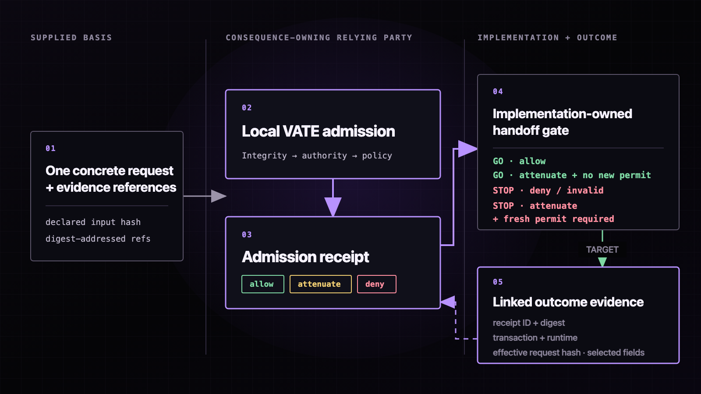

# Verifiable Agent Trust Envelope

**Local admission receipts for risky external digital actions.**

VATE gives the party that owns the consequence a portable record of why one
agent action was allowed, narrowed, or denied. It carries a declared input hash
and digest-addressed evidence references into local admission, then links the
resulting receipt to later outcome evidence.

[Official website](https://vate.rognalia.com/) ·
[v0.3 in 5 minutes](docs/v0.3-in-5-minutes.md) ·
[60-second demo](#try-it-in-60-seconds) ·
[AL2 verifier admission profile](docs/profiles/vate-al2-verifier-admission-profile-v0.3.md)

[](https://doi.org/10.5281/zenodo.19839768)

<picture>
  <source media="(max-width: 600px)" srcset="docs/figures/where-trust-envelope-fits-readme-mobile.png" width="900" height="1200">
  
</picture>

[Open the accessible HTML diagram](docs/figures/where-trust-envelope-fits.html).

## Try It in 60 Seconds

```bash
python3 reference/quickstart-demo/run_demo.py
```

No dependencies. The demo narrates three committed v0.3 corpus cases: `allow`,
`attenuate`, and a fail-closed `deny`.

## What VATE Records

- **One admission basis**: action, target, any requested constraints, actor, principal,
  runtime, audience, a declared input hash, and digest-addressed evidence
  references.
- **One local decision**: policy basis, evidence verification results, reason
  codes, validity, and an `allow`, `attenuate`, or `deny` outcome.
- **Explicit attenuation**: original and effective request hashes, applied
  changes, effective constraints, and whether a fresh permit is required.
- **Decision data for handoff**: the outcome and `require_new_permit` state
  distinguish immediate handoff candidates from `deny`, invalid state, and
  cases requiring a fresh permit; the gate remains implementation-owned.
- **Linked outcome evidence**: the later receipt links the admission receipt ID
  and digest, transaction, runtime, effective request hash, and selected result
  fields.

Attenuation is a first-class outcome. A request for a USD 10000 transfer can be
admitted only with a USD 500 maximum, approval above USD 100, and a short
execution window. The receipt records the declared original and effective
request hashes so later evidence can be checked against the narrowed basis.

## Status and Scope

VATE is a public Apache-2.0 protocol discussion draft. The current archived
review anchor is `v0.3.2`; `main` contains subsequent work on the same AL2
verifier-admission line.

**Current public status:** discussion draft · archived `v0.3.2` review anchor ·
not production-ready · no production approval implied.

VATE composes with A2A, MCP, OAuth, OpenID, VC, SPIFFE, AP2, x402, and payment
mandates. Those systems retain their own validation and execution semantics;
VATE records the consequence-owning relying party's local admission decision
and receipt linkage. Human review may supply policy or evidence, but VATE is not
a human-in-the-loop workflow product.

<details>
<summary>Version history and detailed repository state</summary>


- `v0.1 discussion draft`
- `v0.2.0 archived May 5, 2026 review snapshot`
- `v0.3.0 archived May 10, 2026 AL2 verifier admission hardening snapshot`
- `v0.3.1 archived May 14, 2026 credibility and reviewability patch`
- `v0.3.2 archived July 6, 2026 external review portability and reproducibility patch`
- `not production-ready`
- `not an official A2A extension, endorsement, certification, SDK, middleware package, or general compatibility proof`
- `not an A2A core proposal or universal trust layer`
- `no production approval implied`
- `seeking critique on boundary, verifier order, gap analysis, and artifact semantics`

Current repository state:

- **Repository type**: protocol discussion draft
- **Document maturity**: early draft
- **Primary language**: English
- **Roadmap refresh date**: 2026-07-27
- **Primary battlefield**: `AL2` external digital write
- **Current archived snapshot with version DOI**: `v0.3.2` external review
  portability and reproducibility patch
- **Implemented artifacts**: v0.3 schemas and examples; a runnable AL2 fixture
  corpus with negative cases; SUT comparison and implementation-reporting
  formats; a dependency-free verifier core and A2A-shaped adapter demo;
  package-private TypeScript reference helpers; focused adjacent-evidence
  fixtures and crosswalk notes
- **Evidence target**: collect results from independently maintained
  implementation lines distinct from the repository reference runner, ideally
  with generated artifacts or a controlled artifact bundle, an implementation
  report, and a local bundle verification report for one v0.3 corpus snapshot
- **Planned later**: pairwise presentation profile, richer capability registry,
  formal `AID`, and physical `ABS` profiles

Conformance artifacts record one implementation run against one corpus
snapshot. They do not imply endorsement, production approval, or a general
compatibility claim.

</details>

## Reviewer Entry Points

If you are reviewing the archived `v0.3.2` snapshot or later main-branch work,
start here:

- [Public claim boundary](docs/public-claim-boundary.md) - what this repository
  can and cannot claim publicly
- [One-hour external SUT or corpus review request](docs/conformance/external-sut-ask-1-hour.md) -
  the smallest useful path for unclear cases, reason codes, artifact binding,
  or draft SUT results
- [Independent implementation review issue](https://github.com/Poke-nushi/Verifiable-Agent-Trust-Envelope/issues/2) -
  public intake for external SUT questions, partial results, and implementation
  report links
- [External SUT run records](docs/conformance/external-sut-run-records.md) -
  pinned externally supplied run artifacts used for review
- [Pulse three-case bounded external SUT result](docs/conformance/external-sut-run-records.md#pulse-three-case-bounded-external-sut-run) -
  candidate-owned mapping through a frozen Pulse verifier, with two matching
  decisions and one preserved attenuation-versus-deny difference
- [AEE-native boundary review](docs/interop/aee-native-boundary-review.md) -
  eight executable AEE-native vectors prompted by three pinned VATE cases
- [External implementation call](docs/conformance/external-implementation-call.md) -
  the request for result files, generated artifacts, and implementation reports
- [External SUT quickstart](docs/conformance/external-sut-quickstart.md) - how a
  non-reference implementation can submit a result for `compare`
- [Pulse bounded-attempt starter](examples/external-sut-pulse-starter/README.md) -
  exact-pin inputs, candidate-owned mapping worksheet, frozen-verifier command,
  and unexecuted result/run-record template for the solicited reciprocal trial
- [Implementation reporting](docs/conformance/implementation-reporting.md) - how
  to publish one implementation run against one corpus snapshot
- [A2A review package](docs/a2a/README.md) - metadata-only admission and receipt
  references for A2A-shaped flows
- [Known gaps](docs/known-gaps.md) - unresolved work and residual limitations

## The Problem

An external agent wants to perform a risky write against a remote system. That
write changes a relying party's resource, record, payment state, or account
state outside the agent runtime.

At that boundary, discovery metadata, a valid access token, and a stable
identity label may not answer:

- which actor is acting and on whose behalf
- whether the current runtime is fresh and genuine
- what task-scoped authority exists now
- whether status has narrowed or revoked that authority
- what was admitted before execution
- how later outcome evidence links to that admission

The current AL2 profile makes this boundary concrete. Its semantic decision
basis is:

`status -> identity -> runtime -> permit -> policy`

Before those inputs become authoritative, an implementation still performs
structural parsing, digest checks, proof and trust-anchor checks, freshness
checks, and replay checks. The local verifier then records `allow`, `attenuate`,
or `deny` in a machine-readable admission receipt.

The [VATE AL2 Verifier Admission Profile v0.3](docs/profiles/vate-al2-verifier-admission-profile-v0.3.md)
treats A2A, MCP, OAuth, VC, DID, OID4VP, Web Bot Auth, AP2, x402, ACP, and
payment-token systems as adjacent evidence sources. It defines how a relying
party evaluates referenced evidence for one local action decision; it does not
declare those source artifacts valid by mapping alone. A2A reviewers can start
with the [A2A review package](docs/a2a/README.md).

## What This Draft Adds

The draft's center of gravity is:

- separating **controller**, **principal**, **actor**, and **runtime**
- recording a declared request hash and digest-addressed evidence references in
  one admission basis
- binding actor, principal, runtime, permit or mandate, status, and local policy
  to one action decision
- making verifier-side ordering explicit for external digital writes
- treating **status** and **attenuation** as protocol concerns
- separating verifier-issued **admission receipts** from linked
  **post-execution receipts**
- defining a reference-only **A2A metadata binding** for VATE artifact references

## What This Draft Does Not Replace

VATE is not an agent platform, prompt framework, multi-agent control plane,
connector suite, human-approval UI, gateway, universal trust layer, identity
registry, or global issuer.

It composes with:

- `A2A` for discovery and delegation flow
- `MCP + OAuth` for tool and resource authorization
- `VC / JWT` for portable signed credentials
- `OpenID Federation / CAEP` for trust federation and status signaling
- `SPIFFE / workload identity / cloud attestation` for runtime authenticity anchors
- `AP2 / x402 / ACP / payment tokens` for commerce and payment authorization evidence

See the explicit [non-goals](docs/non-goals.md).

## Close Adjacent Work

The public work most likely to be read as overlapping includes:

- **Agent Permission Protocol (Crittora)**: execution-time permission policy and enforcement
- **Open Agent Passport / APort**: passport and decision objects with policy enforcement
- **Agent Passport System (APS / AEOESS)**: identity, delegation, governance, and commerce
- **AgentROA**: policy enforcement around MCP-routed agent actions
- **Agent Auth / AIP drafts**: identity-first agent authentication and trust work

VATE's center of gravity is the composite admission record across identity,
runtime proof, task-scoped authority, status, local policy, and receipt linkage.
See the [direct comparison note](docs/close-adjacent-work-2026-04.md).

## Read This In 5 Minutes

If you are new to the repository, follow:

1. this `README.md`
2. [docs/public-claim-boundary.md](docs/public-claim-boundary.md)
3. [docs/v0.3-in-5-minutes.md](docs/v0.3-in-5-minutes.md)
4. [docs/profiles/vate-al2-verifier-admission-profile-v0.3.md](docs/profiles/vate-al2-verifier-admission-profile-v0.3.md)
5. [docs/a2a/README.md](docs/a2a/README.md)
6. [docs/a2a/vate-a2a-extension-profile-v0.3.md](docs/a2a/vate-a2a-extension-profile-v0.3.md)
7. [docs/a2a-metadata-binding-v0.3.md](docs/a2a-metadata-binding-v0.3.md)
8. [docs/a2a-v1-extension-sketch-2026-05.md](docs/a2a-v1-extension-sketch-2026-05.md)
9. [docs/receipt-model-v0.3.md](docs/receipt-model-v0.3.md)
10. [docs/receipt-audit-walkthrough-v0.3.1.md](docs/receipt-audit-walkthrough-v0.3.1.md)
11. [docs/a2a-maintainer-brief-v0.3.md](docs/a2a-maintainer-brief-v0.3.md)
12. [docs/profiles/vate-al2-admission-interop-profile-2026-07.md](docs/profiles/vate-al2-admission-interop-profile-2026-07.md)
13. [conformance/al2-vate-v0.3/README.md](conformance/al2-vate-v0.3/README.md)
14. [docs/conformance/external-sut-quickstart.md](docs/conformance/external-sut-quickstart.md)
15. [docs/conformance/implementation-reporting.md](docs/conformance/implementation-reporting.md)
16. section `0` and section `1` of [docs/verifiable-agent-trust-envelope-spec-v0.1.md](docs/verifiable-agent-trust-envelope-spec-v0.1.md)
17. [reference/http-verifier-demo/README.md](reference/http-verifier-demo/README.md)

For the visual system view, see section `11` of
[docs/verifiable-agent-trust-envelope-spec-v0.1.md](docs/verifiable-agent-trust-envelope-spec-v0.1.md).
For the shortest unresolved-work list, read [docs/known-gaps.md](docs/known-gaps.md).

## Review Questions

The most useful feedback is:

- is the verifier-side boundary clear
- is the semantic `status -> identity -> runtime -> permit -> policy` ordering
  sound after proof, digest, trust, freshness, and replay gates fail closed
- are permit, receipt, status, attenuation, and handoff semantics coherent
- can an external SUT produce digest-addressed artifacts, a comparison report,
  and an implementation report without treating the Python reference runner as
  the primary specification
- what should remain core versus move into profiles or extensions

## Repository Map

- [docs/verifiable-agent-trust-envelope-spec-v0.1.md](docs/verifiable-agent-trust-envelope-spec-v0.1.md)
  Detailed requirements and reference architecture
- [docs/close-adjacent-work-2026-04.md](docs/close-adjacent-work-2026-04.md)
  Direct comparison with the closest public adjacent work
- [docs/public-claim-boundary.md](docs/public-claim-boundary.md)
  Allowed, discouraged, and forbidden public claim language for the current
  discussion-draft repository state
- [docs/use-cases.md](docs/use-cases.md)
  Three background scenarios from the original `v0.1` framing
- [docs/verifier-validation-flow.md](docs/verifier-validation-flow.md)
  Verifier-side validation order
- [docs/profiles/al2-minimal-profile.md](docs/profiles/al2-minimal-profile.md)
  Baseline profile for the current reference battlefield
- [docs/profiles/vate-al2-verifier-admission-profile-v0.3.md](docs/profiles/vate-al2-verifier-admission-profile-v0.3.md)
  Narrow v0.3 profile for verifier-side AL2 admission decisions
- [docs/profiles/vate-al2-admission-interop-profile-2026-07.md](docs/profiles/vate-al2-admission-interop-profile-2026-07.md)
  Narrow conformance-facing AL2 admission interop profile
- [docs/profiles/vate-proof-profile-jose-jcs-v0.2.md](docs/profiles/vate-proof-profile-jose-jcs-v0.2.md)
  Review boundary for future JOSE/JCS production proof verification
- [docs/reason-codes.md](docs/reason-codes.md)
  Canonical machine-readable reason codes for AL2 conformance
- [docs/evidence-types.md](docs/evidence-types.md)
  Human-readable evidence type and protocol hint vocabulary for AL2 conformance
- [registries/evidence-vocabulary.v0.3.json](registries/evidence-vocabulary.v0.3.json)
  Canonical machine-readable evidence vocabulary registry, including allowed type/hint pairs
- [docs/attenuation-semantics.md](docs/attenuation-semantics.md)
  Machine-readable attenuation semantics for AL2 conformance
- [docs/v0.3-in-5-minutes.md](docs/v0.3-in-5-minutes.md)
  Short entry point for the v0.3 draft
- [docs/a2a/README.md](docs/a2a/README.md)
  A2A-shaped metadata review package entry point
- [docs/a2a/vate-a2a-extension-profile-v0.3.md](docs/a2a/vate-a2a-extension-profile-v0.3.md)
  Consolidated metadata-only A2A extension profile draft for VATE references
- [docs/a2a-maintainer-brief-v0.3.md](docs/a2a-maintainer-brief-v0.3.md)
  A2A maintainer-oriented summary of the metadata-only admission and receipt binding
- [docs/release-gate-v0.3.0.md](docs/release-gate-v0.3.0.md)
  Archived technical gate used before cutting the v0.3.0 discussion-draft
  pre-release
- [docs/release-notes/v0.3.1.md](docs/release-notes/v0.3.1.md)
  Archived notes for the v0.3.1 credibility and reviewability patch
- [docs/release-notes/v0.3.2.md](docs/release-notes/v0.3.2.md)
  Release notes for the v0.3.2 external review portability and reproducibility patch
- [docs/a2a-issue-update-2026-05.md](docs/a2a-issue-update-2026-05.md)
  Short A2A-adjacent issue update draft after the runnable v0.2 artifacts
- [docs/a2a-metadata-binding-v0.3.md](docs/a2a-metadata-binding-v0.3.md)
  Reference-only A2A metadata binding for VATE admission and receipt artifacts
- [docs/a2a-v1-extension-sketch-2026-05.md](docs/a2a-v1-extension-sketch-2026-05.md)
  A2A v1.0-shaped extension sketch using optional activation, signed Agent Card evidence, and digest-bound VATE references
- [docs/namespace-migration.md](docs/namespace-migration.md)
  Repository-scoped draft URI and persistent namespace migration discipline
- [docs/extension-fields.md](docs/extension-fields.md)
  Handling rules for unknown extension fields before schema tightening
- [docs/ecosystem-positioning-2026-05.md](docs/ecosystem-positioning-2026-05.md)
  Current VATE boundary relative to MCP/OAuth, A2A, AP2, ACP/UCP, and x402
- [docs/receipt-model-v0.3.md](docs/receipt-model-v0.3.md)
  v0.3 split between admission receipts and post-execution receipts
- [docs/receipt-audit-walkthrough-v0.3.1.md](docs/receipt-audit-walkthrough-v0.3.1.md)
  v0.3.1 reviewability walkthrough for following digest-bound receipt,
  post-execution, policy snapshot, and report-bundle references
- [docs/trust-bundle-hardening.md](docs/trust-bundle-hardening.md)
  Trust-bundle checks for issuer, key, algorithm, evidence type, status, and validity windows
- [docs/conformance/corpus-format.md](docs/conformance/corpus-format.md)
  Language-neutral corpus index and digest rules for non-reference implementations
- [docs/conformance/digest-basis.md](docs/conformance/digest-basis.md)
  Digest-basis terminology for corpus, SUT results, evidence objects, receipts, and report bundles
- [docs/conformance/artifact-versioning.md](docs/conformance/artifact-versioning.md)
  Date-stamped conformance artifact versioning rules for the July 2026 target line
- [docs/conformance/sut-adapter-contract.md](docs/conformance/sut-adapter-contract.md)
  SUT result contract and comparison command for external implementations
- [docs/conformance/external-implementation-call.md](docs/conformance/external-implementation-call.md)
  Short call for independent implementation review materials, with the public
  intake thread for questions and result links
- [docs/conformance/external-sut-quickstart.md](docs/conformance/external-sut-quickstart.md)
  Short path for external SUT authors to produce, compare, and bundle-check implementation reports
- [docs/conformance/external-sut-run-records.md](docs/conformance/external-sut-run-records.md)
  Pinned records of externally supplied SUT run artifacts used for review
- [docs/profiles/vate-jose-proof-profile-notes-2026-07.md](docs/profiles/vate-jose-proof-profile-notes-2026-07.md)
  Production JOSE proof profile notes and current detached fixture boundary
- [conformance/al2-vate-v0.3/README.md](conformance/al2-vate-v0.3/README.md)
  Runnable conformance corpus for v0.3 admission and receipt semantics
- [docs/conformance/implementation-reporting.md](docs/conformance/implementation-reporting.md)
  Implementation report format for publishing one run against one corpus snapshot
- [docs/conformance/report-integrity.md](docs/conformance/report-integrity.md)
  Publication and integrity guidance for SUT, conformance, and implementation reports
- [reference/vate-verifier-core/README.md](reference/vate-verifier-core/README.md)
  Dependency-free verifier core for AL2 admission fixtures
- [reference/a2a-metadata-adapter-demo/README.md](reference/a2a-metadata-adapter-demo/README.md)
  Dependency-free A2A-shaped metadata adapter demo
- [packages/vate-core-ts/README.md](packages/vate-core-ts/README.md)
  Package-private TypeScript helpers for digest descriptors, artifact references, and SUT result entries
- [packages/vate-a2a-ts/README.md](packages/vate-a2a-ts/README.md)
  Package-private TypeScript helpers for the reference-only A2A metadata binding
- [docs/interop/oap-aport-crosswalk.md](docs/interop/oap-aport-crosswalk.md)
  OAP / APort decision evidence crosswalk for VATE admission receipts
- [docs/interop/aae-crosswalk.md](docs/interop/aae-crosswalk.md)
  Agent Authorization Envelope evidence crosswalk for VATE admission receipts
- [docs/interop/aee-native-boundary-review.md](docs/interop/aee-native-boundary-review.md)
  Source-pinned AEE-native boundary vectors prompted by three VATE cases
- [docs/interop/ap2-ucp-commerce-crosswalk.md](docs/interop/ap2-ucp-commerce-crosswalk.md)
  AP2 / UCP commerce evidence crosswalk for VATE admission receipts
- [docs/interop/ap2-human-not-present-evidence.md](docs/interop/ap2-human-not-present-evidence.md)
  AP2 Human Not Present payment-authority evidence fixtures
- [docs/interop/payment-evidence-frame-crosswalk.md](docs/interop/payment-evidence-frame-crosswalk.md)
  Payment Evidence Frame evidence crosswalk for VATE admission and post-execution linkage
- [docs/interop/ep-aps-can-execution-admission-crosswalk.md](docs/interop/ep-aps-can-execution-admission-crosswalk.md)
  EP-AEC, EP-AEG, APS, and CAN boundary crosswalk for VATE execution admission
- [docs/interop/external-evidence-vector-intake.md](docs/interop/external-evidence-vector-intake.md)
  Non-normative intake rules for external evidence vector slices
- [docs/interop/external-evidence-vector-pins.md](docs/interop/external-evidence-vector-pins.md)
  Pinned non-normative external evidence vector slices for review
- [docs/interop/rcl-receipt-claim-projection.md](docs/interop/rcl-receipt-claim-projection.md)
  Source-pinned RCL-005/006/008 carry-plus-projection boundary and canonical
  VATE case mapping
- [docs/known-gaps.md](docs/known-gaps.md)
  Current unresolved design gaps
- [reference/minimal-al2-demo/README.md](reference/minimal-al2-demo/README.md)
  Educational artifact and status demo
- [reference/http-verifier-demo/README.md](reference/http-verifier-demo/README.md)
  Verifier-centered HTTP wedge

## Verification

Reading the draft does not require any local setup.
The optional dependency below is only for contributors who want strict JSON Schema validation, and the virtual environment should live outside this repository.

Dependency-free sanity check:

```bash
python3 scripts/check_repo.py
```

The AL2 corpus has separate commands for repository fixture checks and external
implementation comparison:

```bash
python3 scripts/vate_conformance.py run \
  --corpus-root conformance/al2-vate-v0.3 \
  --report /tmp/vate-conformance-report.json
```

`run` checks the committed fixture artifacts with the reference runner. It is
not an external implementation result.

```bash
python3 scripts/vate_conformance.py compare \
  --corpus-root conformance/al2-vate-v0.3 \
  --sut-results examples/conformance/sut-results-pass.example.json \
  --report /tmp/vate-sut-compare-report.json
```

`compare` checks an external SUT result file against the same corpus snapshot.
Independent implementation review should use the SUT adapter contract and the
`compare` path. The default `corpus-fixture-validation` mode checks submitted
artifact references against the fixed-vector bytes; it does not establish that
the SUT evaluated them. `generated-receipts` keeps separately submitted receipt
bytes distinct and rechecks their digest, bounded semantics, and post-execution
linkage. External SUT authors can start with
[docs/conformance/external-sut-quickstart.md](docs/conformance/external-sut-quickstart.md).
Questions, partial results, unsupported-case reports, and implementation report
links can be shared in
[issue #2](https://github.com/Poke-nushi/Verifiable-Agent-Trust-Envelope/issues/2).

Optional strict schema validation:

```bash
python3 -m venv ../verifiable-agent-trust-envelope-draft-venv
. ../verifiable-agent-trust-envelope-draft-venv/bin/activate
python3 -m pip install -r requirements-dev.txt
python3 scripts/check_repo_strict.py
```

Package-private TypeScript reference helpers are available for contributors who
want language-level examples of the same digest-bound reference and A2A metadata
shapes:

```bash
npm ci
npm run ts:check
npm run ts:test
```

These packages are not official A2A extensions, endorsements, certifications,
SDKs, middleware packages, or general compatibility proofs. They do not imply
production approval and do not add production JOSE/JCS verification.

## Related Documents

- [FAQ.md](FAQ.md)
- [ROADMAP.md](ROADMAP.md)
- [docs/public-claim-boundary.md](docs/public-claim-boundary.md)
- [CONTRIBUTING.md](CONTRIBUTING.md)
- [SECURITY.md](SECURITY.md)
- [docs/standards-and-ecosystem-landscape-2026-04.md](docs/standards-and-ecosystem-landscape-2026-04.md)
- [docs/standards-and-ecosystem-landscape-2026-05.md](docs/standards-and-ecosystem-landscape-2026-05.md)
- [docs/v0.3-in-5-minutes.md](docs/v0.3-in-5-minutes.md)
- [docs/a2a/README.md](docs/a2a/README.md)
- [docs/a2a/vate-a2a-extension-profile-v0.3.md](docs/a2a/vate-a2a-extension-profile-v0.3.md)
- [docs/a2a-maintainer-brief-v0.3.md](docs/a2a-maintainer-brief-v0.3.md)
- [docs/release-notes/v0.3.0.md](docs/release-notes/v0.3.0.md)
- [docs/non-goals.md](docs/non-goals.md)
- [docs/delegated-identity-composition-example.md](docs/delegated-identity-composition-example.md)
- [docs/transport-bindings.md](docs/transport-bindings.md)
- [docs/a2a-metadata-binding-v0.3.md](docs/a2a-metadata-binding-v0.3.md)
- [docs/a2a-v1-extension-sketch-2026-05.md](docs/a2a-v1-extension-sketch-2026-05.md)
- [docs/receipt-model-v0.3.md](docs/receipt-model-v0.3.md)
- [docs/jws-packaging-and-status-delivery.md](docs/jws-packaging-and-status-delivery.md)
- [docs/threat-model.md](docs/threat-model.md)
- [docs/status-network-model.md](docs/status-network-model.md)
- [docs/conformance-and-negative-tests.md](docs/conformance-and-negative-tests.md)
- [docs/interop/aae-crosswalk.md](docs/interop/aae-crosswalk.md)
- [docs/interop/payment-evidence-frame-crosswalk.md](docs/interop/payment-evidence-frame-crosswalk.md)

## Authoring Note

The author and maintainer is **Takao Sato (Poke-nushi)**.
`Poke-nushi` is the same author's public maintainer alias and also appears in
archived artifacts and historical repository records.
AI tools were used to assist drafting, review, and reference implementation work in this repository.
The maintainer is responsible for the final structure, scope decisions, and published contents.

## How to Cite

If you reference the archived July 6, 2026 `v0.3.2` external review portability
and reproducibility patch, cite:

- Version DOI: [10.5281/zenodo.21226254](https://doi.org/10.5281/zenodo.21226254)
- All-version concept DOI: [10.5281/zenodo.19839768](https://doi.org/10.5281/zenodo.19839768)

If you reference unarchived main-branch changes after `v0.3.2`, cite the
repository URL and exact commit SHA in addition to the latest applicable
archived version DOI.

If you reference the archived May 14, 2026 `v0.3.1` credibility and
reviewability patch, cite:

- Version DOI: [10.5281/zenodo.20173995](https://doi.org/10.5281/zenodo.20173995)

If you reference the archived May 10, 2026 `v0.3.0` discussion-draft
pre-release snapshot, cite:

- Version DOI: [10.5281/zenodo.20107413](https://doi.org/10.5281/zenodo.20107413)

If you reference the archived May 5, 2026 `v0.2.0` snapshot, cite:

- Version DOI: [10.5281/zenodo.20043166](https://doi.org/10.5281/zenodo.20043166)

- Earlier `v0.1.0` DOI: [10.5281/zenodo.19839769](https://doi.org/10.5281/zenodo.19839769)
- Machine-readable metadata: [CITATION.cff](CITATION.cff)

## License

This repository is licensed under the [Apache License 2.0](LICENSE).
