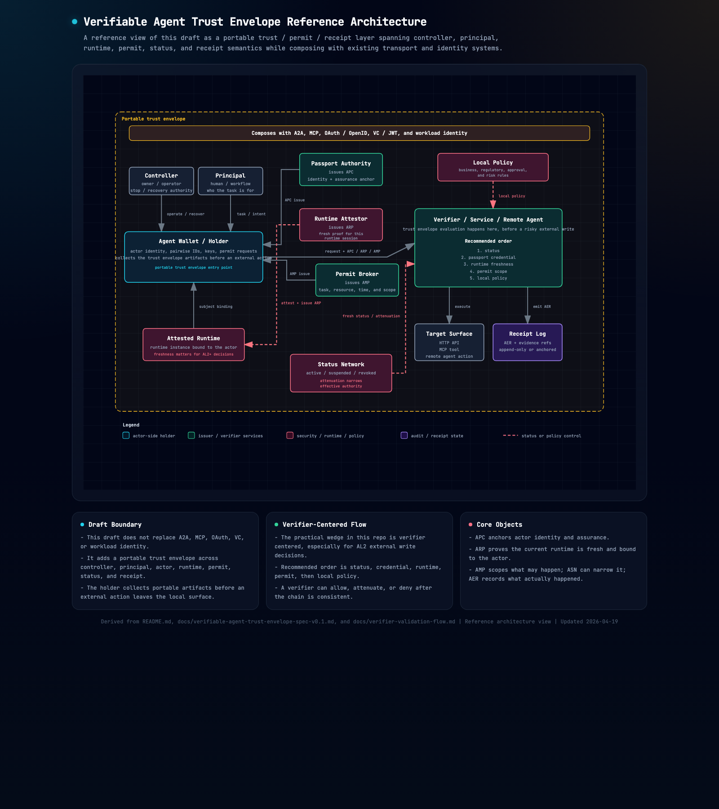
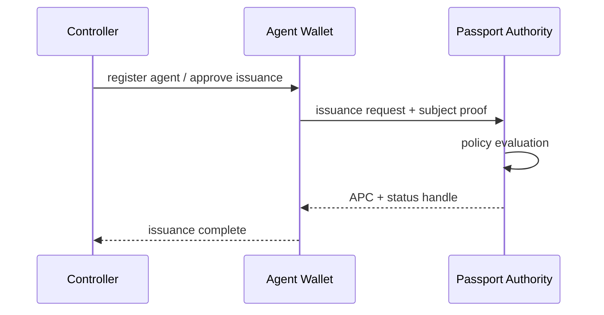
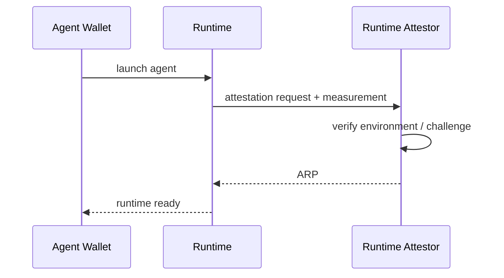
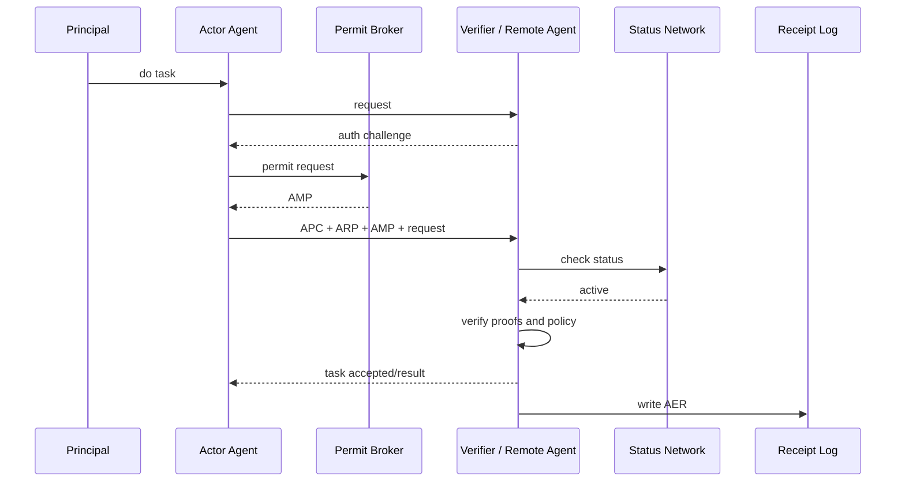
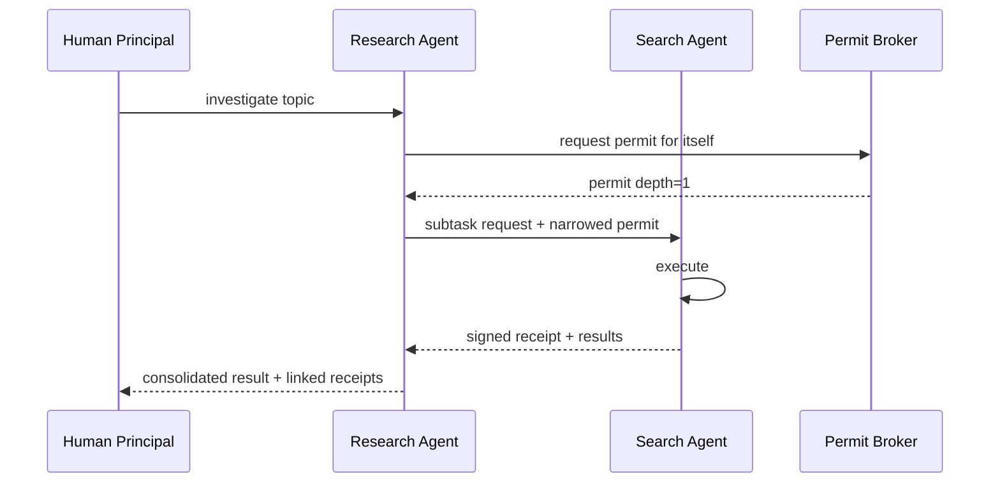

# Verifiable Agent Trust Envelope v0.1 Draft
## Detailed Requirements & Reference Architecture

**Status:** Draft / Discussion Document  
**Audience:** protocol designers, IAM / security engineers, agent platform builders, client / verifier builders, robotics / mobility architects  
**Language style:** English primary

---

## Conformance Language

The key words **MUST**, **MUST NOT**, **SHOULD**, **SHOULD NOT**, and **MAY** in this document are to be interpreted as described in BCP 14 / RFC 2119 / RFC 8174 when, and only when, they appear in all capitals.

This draft also distinguishes between:

- **core** - the smallest interoperable surface intended for cross-implementation reuse
- **profile** - deployment or assurance-level guidance built on the core
- **extension** - optional semantics outside the minimal interoperable core

---

## 0. Executive Summary

This draft addresses a narrow question:

When an external agent wants to perform a risky write against a remote system, what portable artifacts should the relying party verify before allowing the action?

At that moment, the verifier often needs more than:

- discovery metadata
- a valid access token
- a stable identity label

It may also need to know:

1. **Actor** - who is acting
2. **Principal** - on whose behalf it acts
3. **Runtime** - whether the current runtime is fresh and genuine
4. **Permit** - what task-scoped authority exists right now
5. **Status** - whether that authority has been narrowed or revoked
6. **Receipt** - what evidence should exist after execution

This draft proposes a portable trust envelope for that boundary.
For publication and reference implementation purposes, it deliberately treats **AL2 external digital write** as the primary `v0.1` battlefield.
The current repository therefore includes a verifier-centered HTTP wedge that:

- applies `status -> identity -> runtime -> permit -> policy`
- returns `allow / attenuate / deny`
- emits a machine-readable receipt

This draft is not intended to replace A2A, MCP, VC / JWT, OpenID, OAuth, SPIFFE, workload identity, or control-plane products.
It is intended to compose with those layers at the point where a verifier must admit, narrow, or deny a risky external action.

---

## 1. Problem Statement

The current agent stack already has emerging building blocks for:

- discovery and delegation flow
- tool and resource authorization
- portable credentials
- runtime identity and attestation
- gateway and control-plane enforcement

What remains underspecified is the verifier-side admission decision when an external agent crosses into a remote system and requests a risky write.

For that decision, the relying party may need to separate:

- actor from principal
- capability from authority
- vendor authentication from portable third-party presentation
- stable identity from fresh runtime proof
- standing access from task-scoped permit
- successful execution from later evidence

### 1.1 What The Verifier Still Needs At Decision Time
- whether the actor identity is acceptable for this relying party
- whether the runtime is genuine and fresh enough for the requested assurance level
- whether the current task really exists and who it is for
- whether authority is scoped to this action, resource, amount, time, and redelegation depth
- whether status has suspended, revoked, or attenuated that authority
- whether a machine-readable receipt is required if the action is allowed

### 1.2 Why This Boundary Matters
If this boundary stays implicit, common failure modes follow:

- discovery claims get mistaken for authority
- access tokens get treated as enough proof for every high-risk action
- runtime compromise is missed because only long-lived identity is checked
- status changes arrive too late to narrow or stop execution
- after-the-fact disputes lack a portable receipt

This is why the draft treats the problem less like generic agent branding and more like verifier-side admission control for action.

### 1.3 Why `AL2` External Digital Write Is The `v0.1` Wedge
The repo does not try to solve every agent interaction first.
It starts where the trust decision is concrete and reviewable:

- an external write
- against a remote relying party
- with meaningful downside if the decision is wrong

That gives the draft a narrow battlefield for arguing about boundary, ordering, artifact semantics, and evidence requirements before broader profiles are added.

---

## 2. Scope

### 2.1 In Scope
- verifier-side admission decisions for external agent actions
- agent identity presentation model
- credential issuance model
- runtime binding
- task-scoped permit model
- execution receipt model
- status / revocation / risk attenuation
- controller / principal / actor distinctions
- an initial `AL2` external digital write profile
- interoperability with A2A / MCP / OAuth / VC / workload identity

### 2.2 Out of Scope
- discovery or messaging protocol design itself
- full agent platform orchestration
- gateway or API management product behavior
- LLM model internals
- payment settlement protocol itself
- universal reputation formula
- robot control bus specifics
- national legal identity / KYC rules per jurisdiction
- one true blockchain / one true PKI / one true DID method

---

## 3. Design Goals

### 3.1 Primary Goals
1. **Portability**  
   the trust envelope model should not be locked to one vendor or one cloud

2. **Task-scoped trust**  
   the model should express permissions limited to the current action, not broad standing authority

3. **Runtime authenticity**  
   verifiers should be able to validate the current runtime instance, not just a long-lived identity label

4. **Revocability**  
   compromise and policy changes should be reflected quickly

5. **Auditability**  
   high-risk actions should remain auditable after the fact

6. **Privacy-preserving identity**  
   the model should avoid forcing a single global tracking identifier

7. **Transport independence**  
   the design should work across A2A, MCP, HTTPS, P2P, on-chain, and robotic networks

### 3.2 Non-Goals
- forcing every agent to use a real-name passport
- requiring a single global identity issuer
- treating agents as fully identical to human legal subjects

---

## 4. Core Concepts

### 4.1 Controller
The entity that can manage the agent, stop it, change policy, and rotate keys.  
This could be an individual, a company, a team, a fleet owner, or a platform operator.

### 4.2 Principal
The requesting party behind a task.  
This could be a human user, an enterprise workflow, another agent, or a scheduler.

### 4.3 Actor
The agent currently executing the action.

### 4.4 Runtime
The concrete execution environment in which the actor is running.  
Examples include a local process, terminal tool, container, VM, cloud sandbox, browser session, robot controller, or vehicle ECU.

### 4.5 Capability
What the agent claims it is capable of doing: skills, functions, or domain expertise.

### 4.6 Authority
Authorization to exercise that capability **now**, in the current context.

### 4.7 Assurance Level
The strength of assurance requirements. This draft defines AL0 through AL4.

---

## 5. Threat Model

This draft is intended to reduce the following classes of threats.

### 5.1 Identity Spoofing
A malicious actor impersonates another agent or another organization.

### 5.2 Runtime Substitution
The passport may be real, but the runtime actually executing is not the legitimate one.

### 5.3 Over-delegation
A permit expands to tasks, resources, or amounts that were never intended.

### 5.4 Replay / Token Theft
Permits or tokens are stolen and replayed.

### 5.5 Hidden Re-delegation
An agent silently redelegates to another agent without authorization.

### 5.6 Capability Inflation
An agent overstates self-claimed skills in order to gain access or admission.

### 5.7 Status Lag
A verifier authorizes based on stale status after revocation or suspension.

### 5.8 Correlation / Tracking
The same agent becomes trackable across multiple relying parties.

### 5.9 Receipt Forgery
Execution evidence is forged or inconvenient evidence is suppressed.

### 5.10 Physical Harm
A physical AI system acts outside its permit or safety envelope.

---

## 6. Design Principles

### 6.1 Separate Identity from Session
Passports are relatively stable. Permits and runtime proofs should be short-lived.

### 6.2 Separate Public Discovery from Sensitive Proof
Do not treat a public business card such as an A2A Agent Card as equivalent to sensitive proof of authority, ownership, or regulatory status.

### 6.3 Prefer Pairwise Identifiers
Avoid reusing one public global identifier everywhere; allow pairwise identifiers per verifier or relying party.

### 6.4 Use Least Privilege as the Default
Permits should narrow authority by resource, action, time, geography, amount, and redelegation depth.

### 6.5 Require Receipts for High-Risk Actions
High-risk actions should require receipts.  
Returning only a result is not enough; `who / principal / policy / runtime / evidence` should be available.

### 6.6 Treat Status as a First-Class Protocol
Revocation should not be treated as an afterthought; continuous signaling matters.

### 6.7 Keep the Core Open; Monetize Operations
The protocol core should remain open, while deployment and operational models stay outside the core specification.

---

## 7. Core Object Model

This draft does not treat the trust envelope as a single object. It uses a composite model instead.
The `APC / ARP / AMP / AER / ASN` labels remain in `v0.1` as legacy mnemonics carried over from the earlier working title.

### 7.1 Implemented Core Objects In This Draft

The current repository implements and normatively focuses on:

- `APC`
- `ARP`
- `AMP`
- `AER`
- `ASN`

The identifiers behind those objects may come from DIDs, key-based identifiers, cloud principals, workload identities, or vendor-specific roots.
Formal identifier abstraction (`AID`) and physical body extensions (`ABS`) remain future work rather than core v0.1 objects.

### 7.2 APC - Agent Passport Credential
The signed credential that represents the agent passport itself.

#### Required fields
- passport_id
- subject
- controller
- issuer
- assurance_level
- capabilities
- status ref
- valid_from / valid_until

#### Recommended fields
- governance or policy profile refs
- packaging profile or presentation binding
- pairwise presentation hints

#### Capability claims categories
- self_declared
- verified
- observed
- regulatory / certification bound
- hardware-bound capability

### 7.3 ARP - Agent Runtime Proof
A short-lived proof that the runtime is bound to the passport subject.

#### Required fields
- runtime_id
- subject_id
- attestor
- environment type
- workload measurement / attestation hash
- issued_at / expires_at
- nonce / challenge binding
- presented key binding

#### Recommended fields
- packaging profile or presentation binding
- audience binding when the verifier is known in advance

### 7.4 AMP - Agent Mission Permit
Task-scoped authorization artifact.

#### Required fields
- permit_id
- transaction_id
- actor
- target resource / verifier
- authorized actions
- constraints
- max redelegation depth
- approval policy
- issued_at
- expiry window, typically expressed in permit constraints
- proof-of-possession binding

#### Optional fields
- principal (optional in autonomous mode)
- geography or jurisdiction hints
- tool allowlist refinements

### 7.5 AER - Agent Execution Receipt
A signed receipt describing the execution outcome.

#### Required fields
- receipt_id
- transaction_id
- actor
- verifier / resource
- skill / tool / version
- runtime_ref
- policy ref
- start / end
- outcome
- issuer_role
- signature package or equivalent integrity protection

#### Recommended fields
- principal when present
- input hash/ref
- output hash/ref
- evidence references
- artifact digests

#### Receipt Signer Semantics

This draft distinguishes between receipt contents and receipt signer role.
At minimum, a receipt should declare which role signed it:

- `runtime` - the actor runtime signs what it claims it executed
- `verifier` - the relying party signs what it accepted or observed
- `broker` - an intermediary signs a policy or settlement-side record

This draft allows all three.
The repository now includes both:

- a packaging-focused minimal demo that uses runtime-signed receipts
- a verifier-centered HTTP wedge that uses verifier-signed receipts

### 7.6 ASN - Agent Status Network
The layer responsible for status, revocation, suspension, incident handling, and risk attenuation.

#### Core status classes
- active
- suspended
- revoked
- quarantined
- attenuated

#### Profile or extension states

States such as `degraded`, `disputed`, `body_maintenance_overdue`, or `restricted_by_policy` may still be useful, but they are out of the v0.1 core unless a profile defines their verifier behavior explicitly.

#### Machine-readable attenuation

If an object is `attenuated`, the status assertion SHOULD carry a machine-readable `effect` object that narrows how the verifier may continue.
Typical effect constraints include:

- lower transaction limits
- narrower tool allowlists
- lower redelegation depth
- stronger approval requirements
- `require_new_permit` when automatic narrowing is unsafe

---

## 8. Assurance Levels

### 8.1 AL0 - Local / No External Side Effects
- local single-user
- no external write
- no money movement
- no regulated data
- no public external admission requirement

**Required**  
- none, or local identity only

**Recommended**
- local receipts
- kill switch

### 8.2 AL1 - Private / Known Peer
- private agent mesh
- known peers
- read-mostly / low consequence actions

**Required**
- local subject identifier or simplified APC
- simplified APC
- short-lived session auth

**Recommended**
- runtime proof
- receipts for write actions

### 8.3 AL2 - External Digital Action
- public or semi-public external service
- money, escrow, external write, knowledge sale, third-party service call

**Required**
- APC
- ARP
- AMP
- AER
- status checking
- explicit redelegation constraints

For v0.1 publication, this is the narrowest implementation wedge the repository prioritizes.
The current reference path is an HTTP verifier that accepts the trust envelope artifacts, evaluates them in verifier order, and returns `allow`, `attenuate`, or `deny`.

### 8.4 AL3 - Regulated / Sensitive
- PII
- finance
- medical
- legal
- contract-signing
- customer-impacting workflows

**Required**
- high-assurance issuer
- structured permits
- human approval rules
- continuous status signals
- immutable receipts
- stronger privacy profile
- recovery / rotation procedures

### 8.5 AL4 - Physical / Safety-Critical
- robots
- vehicles
- drones
- industrial equipment
- real-world actuation

**Required**
- body supplement
- hardware attestation
- operator / fleet linkage
- geofence / safety envelope
- remote stop / safe mode
- maintenance and inspection status
- software provenance

---

## 9. Functional Requirements

### 9.1 Identity & Issuance

**FR-1** an issuer MUST be able to issue APC to a subject controlled by a controller.
**FR-2** subject MUST support key rotation without invalidating historical receipts.  
**FR-3** controller transfer MUST be representable.  
**FR-4** one principal MAY control multiple agents.  
**FR-5** one agent MAY operate across multiple runtimes.  
**FR-6** same root subject MUST support multiple public aliases.  
**FR-7** issuer MUST be separable from controller.  
**FR-8** the protocol MUST support self-issued low-assurance credentials and externally issued higher-assurance credentials.

### 9.2 Runtime Binding

**FR-9** verifier MUST be able to challenge the runtime and verify proof-of-possession.  
**FR-10** runtime proof SHOULD be short-lived and renewable.  
**FR-11** runtime proof MUST be bound to a specific environment and nonce/challenge.  
**FR-12** compromise of one runtime MUST NOT automatically compromise all runtimes.  
**FR-13** runtime quarantine MUST be possible independent of root passport revocation.

### 9.3 Delegation & Permits

**FR-14** the protocol MUST distinguish controller, principal, and actor.
**FR-15** autonomous tasks MUST be representable without a human principal.  
**FR-16** permit MUST support action-scoped, resource-scoped, and time-bounded authorization.  
**FR-17** permit MUST support amount bounds, geography bounds, and tool bounds where relevant.  
**FR-18** permit MUST support explicit redelegation depth.  
**FR-19** permit MUST support human approval references.  
**FR-20** permit MUST support audience restriction to a target verifier/resource.  
**FR-21** permit SHOULD support replacement / narrowed-down permits in delegated chains.

### 9.4 Receipts & Audit

**FR-22** high-risk actions MUST generate signed receipts.  
**FR-23** receipt MUST reference runtime, permit, and applicable policy.  
**FR-24** receipt MUST be tamper-evident.  
**FR-25** receipt SHOULD support evidence references (hashes, artifact URLs, provenance docs).  
**FR-26** receipt retention policies MUST be configurable by domain and regulation.  
**FR-27** receipt correlation between parent and child agents SHOULD be supported.

### 9.5 Revocation & Status

**FR-28** key, credential, runtime, permit, and skill MUST be revocable independently.  
**FR-29** verifiers MUST be able to check current status online.  
**FR-30** environments with intermittent connectivity SHOULD support signed cached status with bounded freshness.  
**FR-31** risk events SHOULD support push-based attenuation signals.  
**FR-32** profiles SHOULD be able to express non-blocking review or dispute states without forcing full revocation.  
**FR-33** physical profiles SHOULD be able to express maintenance-overdue states that attenuate or block AL4 permits.

### 9.6 Privacy

**FR-34** verifiers SHOULD receive only the minimum identity information required.  
**FR-35** pairwise or domain-specific identifiers SHOULD be supported.  
**FR-36** long-lived public identifiers SHOULD be avoidable for privacy-sensitive end-user use.  
**FR-37** legal or regulated use cases MAY require recoverable controller identity under due process or policy.  
**FR-38** selective disclosure SHOULD be supported at the presentation layer.

### 9.7 External Admission

**FR-39** external services or exchanges MAY define additional admission policies on top of the protocol.
**FR-40** unpassportable agents MAY still participate at AL0/AL1 in private contexts.  
**FR-41** AL2+ public external interaction SHOULD require passport + permit + receipt capability.  
**FR-42** sybil-resistance hooks MAY include invite, stake, attestation, or reputation gate, but MUST NOT be required by the core protocol.

### 9.8 Physical AI

**FR-43** physical agents MUST distinguish mind identity and body identity.  
**FR-44** body identity MUST support inspection and maintenance status.  
**FR-45** high-risk body actions MUST support operator/fleet linkage.  
**FR-46** permit MUST express safety envelope constraints.  
**FR-47** remote stop or safe mode controls SHOULD be representable.  
**FR-48** firmware / software provenance SHOULD be linkable from receipts or runtime proofs.

---

## 10. Non-Functional Requirements

**NFR-1 Performance**  
Verification overhead SHOULD be acceptable for interactive agent calls and bounded for external interactions.

**NFR-2 Availability**  
Status outages MUST degrade safely.  
For AL3/AL4, fail-closed SHOULD be default.

**NFR-3 Interoperability**  
The protocol MUST map onto existing HTTP / OAuth / JSON / JWT / VC ecosystems.

**NFR-4 Composability**  
The protocol MUST work over A2A, MCP, REST, P2P, and proprietary transports.

**NFR-5 Human Operability**  
Humans must be able to read a summarized explanation of what permit was granted and why.

**NFR-6 Recovery**  
Lost device / compromised runtime / key rotation recovery procedures must exist.

**NFR-7 Observability**  
Security-relevant actions SHOULD emit machine-consumable events.

**NFR-8 Compliance Profiles**  
Different assurance / jurisdiction / industry profiles SHOULD be composable.

---

## 11. Reference Architecture



Figure 1. Reference architecture view of this draft as a portable trust / permit / receipt layer across controller, principal, runtime, permit, status, verifier, and receipt semantics.

Source file: [figures/trust-envelope-reference-architecture.html](figures/trust-envelope-reference-architecture.html)

### 11.1 Components

#### Agent Wallet / Holder
A local or hosted holder system managed by an individual or a team.  
It manages subject identifiers, APC, keys, pairwise identifiers, permit requests, and receipts.

#### Passport Authority
Credential issuer.  
It manages controller binding, assurance profiles, and revocation roots.

#### Runtime Attestor
Verifies the authenticity of the running runtime and issues ARP.

#### Permit Broker / Transaction Token Service
Issues AMP based on principal, actor, resource, and policy context.

#### Registry / Resolver
Discovery and resolution layer.  
Public information such as A2A Agent Cards may be linked here, but this draft does not require a central registry.

#### Status Network
Credential status lists plus incident push signaling.  
Handles revocation and risk attenuation.

#### Receipt Log / Transparency Log
Stores receipts in append-only form, or at minimum anchors their hashes.

#### Physical Body / Device Controller
The body-side controller for physical AI systems.  
May include secure elements, maintenance records, and operator binding.

---

## 12. Protocol Mapping to Existing Standards

This draft is designed to reuse existing technologies wherever possible.

| Envelope Layer | Existing Building Blocks |
|---|---|
| Public Discovery | A2A Agent Card |
| Tool Access Auth | MCP Authorization + OAuth 2.1 |
| Root Identifier | DID / key ID / cloud principal |
| Runtime Identity | SPIFFE / workload identity / cloud agent identity |
| Delegation | OAuth Token Exchange / agent transaction tokens |
| Fine-grained Permit | OAuth RAR + resource indicators |
| PoP Binding | DPoP or mTLS |
| Credential Format | VC-like or JWT-like signed object |
| Status | Bitstring status lists + CAEP / SSF events |
| Receipts | signed JSON + provenance / transparency mechanisms |
| Physical Extension | Remote ID / R155 / R156 inspired profiles |

### 12.1 Why not replace A2A?
A2A is strong at **discover and talk**.  
This draft complements it with **trust and authorize** semantics.

### 12.2 Why not replace MCP?
MCP is strong at **tool and resource access**.  
This draft complements it with **who is calling, on whose behalf, and under what permit**.

### 12.3 Why not use only DID/VC?
DID/VC is useful for portable credentials, but it does not by itself fully handle runtime proof, continuous attenuation, or task-scoped permits.

### 12.4 Why not use only cloud agent identity?
Cloud-native identity is powerful, but it can be too closed for multi-vendor, P2P, on-chain, or personal/local agent settings.

---

## 13. Proposed Protocol Suite

### 13.1 Issue
Passport issuance and renewal flow.

#### Inputs
- controller identity
- subject root key or equivalent
- assurance policy
- optional capability attestations

#### Outputs
- APC
- status handle
- recovery metadata
- issuer transparency entry

### 13.2 Bind
Runtime binding flow.

#### Inputs
- APC
- runtime measurement
- attestation challenge

#### Outputs
- ARP
- runtime-specific session material

### 13.3 Permit
Mission permit flow.

#### Inputs
- principal context
- actor context
- target resource
- requested actions
- constraints
- policy context

#### Outputs
- AMP

### 13.4 Receipt
Execution receipt schema and emission flow.

#### Inputs
- AMP
- ARP
- execution metadata
- evidence references

#### Outputs
- AER
- optional receipt anchor / transparency proof

### 13.5 Status
Status query + push model.

#### Inputs
- passport / runtime / permit refs
- event subscriptions

#### Outputs
- current state
- signed event stream

### 13.6 Body
Physical supplement for robots / vehicles / drones.

#### Inputs
- body attestation
- maintenance data
- operator/fleet binding
- current safety context

#### Outputs
- body supplement credential
- body runtime proof
- safety permit constraints

---

## 14. Data Model

### 14.1 Passport Credential Example Shape

```json
{
  "version": "appc-0.1",
  "passport_id": "appc:8f85b2e6-cc6f-4b18-a90a-fb7b80f0842c",
  "subject": {
    "root_id": "did:key:z6Mkn...",
    "public_alias": "agent:public:ops-reviewer-01"
  },
  "controller": {
    "id": "org:example:store-ops",
    "type": "organization"
  },
  "issuer": {
    "id": "issuer:example:passport-authority"
  },
  "assurance_level": "AL2",
  "capabilities": {
    "self_declared": ["code_review", "report_generation"],
    "verified": ["pii_read_redacted_only"],
    "observed": ["success_rate:report_generation>=0.96"]
  },
  "status_ref": "https://status.example/passports/appc:8f85...",
  "valid_from": "2026-04-15T00:00:00Z",
  "valid_until": "2027-04-15T00:00:00Z"
}
```

In the compact JWS demo profile, this decoded payload is packaged separately as a signed JWS token.

### 14.2 Runtime Proof Example Shape

```json
{
  "version": "arp-0.1",
  "runtime_id": "arp:09cd",
  "subject_id": "did:key:z6MknExampleRootKey",
  "attestor": {
    "id": "attestor:example:runtime-authority"
  },
  "environment": {
    "type": "container",
    "class": "cloud-sandbox",
    "measurement": "sha256:example-workload-measurement"
  },
  "challenge_binding": {
    "nonce": "nonce:1f3c",
    "aud": "https://remote-agent.example/a2a"
  },
  "presented_key": {
    "kid": "runtime-key-77",
    "alg": "ES256",
    "spki_sha256": "sha256:example-runtime-spki"
  },
  "issued_at": "2026-04-15T02:00:30Z",
  "expires_at": "2026-04-15T02:05:00Z"
}
```

In the compact JWS demo profile, this decoded payload is packaged separately as a signed JWS token.

### 14.3 Mission Permit Example Shape

```json
{
  "version": "amp-0.1",
  "permit_id": "amp:txn-18f4",
  "transaction_id": "txn:6e7d",
  "actor": "agent:public:ops-reviewer-01",
  "principal": "user:pairwise:service-x:ab12",
  "aud": "https://remote-agent.example/a2a",
  "issued_at": "2026-04-15T02:00:40Z",
  "actions": ["task.execute", "files.read"],
  "constraints": {
    "resource": "project:alpha",
    "max_amount_usd": 0,
    "max_redelegation_depth": 0,
    "expires_at": "2026-04-15T02:05:00Z"
  },
  "approval": {
    "mode": "policy_auto",
    "policy_ref": "policy:org:alpha:low-risk-readonly"
  },
  "proof_binding": {
    "type": "cnf-kid",
    "kid": "runtime-key-77",
    "spki_sha256": "sha256:example-runtime-spki"
  }
}
```

In the compact JWS demo profile, this decoded payload is packaged separately as a signed JWS token.

### 14.4 Execution Receipt Example Shape

```json
{
  "version": "aer-0.1",
  "receipt_id": "aer:54f2",
  "transaction_id": "txn:6e7d",
  "actor": "agent:public:ops-reviewer-01",
  "principal": "user:pairwise:service-x:ab12",
  "runtime_ref": "arp:09cd",
  "permit_ref": "amp:txn-18f4",
  "verifier": "https://remote-agent.example/a2a",
  "issuer_role": "runtime",
  "skill": {
    "id": "report_generation",
    "version": "1.3.2"
  },
  "input_hash": "sha256:...",
  "output_hash": "sha256:...",
  "policy_ref": "policy:org:alpha:low-risk-readonly",
  "evidence_refs": ["urn:artifact:demo:summary-v1"],
  "artifact_digests": {
    "request": "sha256:example-request-digest",
    "response": "sha256:example-response-digest"
  },
  "started_at": "2026-04-15T02:01:15Z",
  "finished_at": "2026-04-15T02:01:42Z",
  "outcome": "success"
}
```

In the compact JWS demo profile, this decoded payload is packaged separately as a signed JWS token.

---

## 15. Sequence Flows

### 15.1 Issuance Flow



### 15.2 Runtime Binding Flow



### 15.3 External Agent Call Flow



### 15.4 Delegated Multi-Agent Flow



---

## 16. Deployment Contexts (Informative)

This chapter is non-normative and is included only to clarify deployment contexts for this draft.

### 16.1 Local and Desktop Agents
- terminal agent
- local coding agent
- desktop automation agent
- browser-assisted agent

In this context, pairwise identifiers, task-scoped permits, runtime separation, and local receipts are especially important.

### 16.2 Hosted and Organization-Managed Agents
- cloud-hosted agent runtime
- organization-managed automation
- delegated team agent
- service-integrated agent

In this context, controller separation, stronger issuance, status propagation, and auditability are especially important.

### 16.3 Cross-Organization Agent Interaction
- partner agent calls
- third-party service agent access
- regulated or policy-constrained workflows
- delegated multi-agent execution

In this context, issuer trust, runtime proof, verifier checks, receipts, and redelegation constraints are especially important.

---

## 17. Related Ecosystem Context (Informative)

This chapter is also non-normative and shows the surrounding ecosystem contexts this draft may connect to.

### 17.1 Inter-Agent Protocols
Protocols such as A2A are strong for discovery and task delegation.  
This draft complements them with the trust / permit / receipt layer beyond that.

### 17.2 Tool and Resource Access
Protocols such as MCP are strong for tool and resource access.  
This draft complements them with caller identity, principal linkage, runtime proof, and task permits.

### 17.3 P2P and External Exchange
In P2P networks and external exchange contexts, the critical concerns include:
- peer admission
- runtime authenticity
- permit narrowing
- execution receipts
- revocation / quarantine

This draft can provide an object model for these concerns.

---

## 18. Physical AI Extension

### 18.1 Separate Mind and Body
In physical AI settings, software agents and bodies/devices should be modeled separately.

- **Mind Passport**
  - skill
  - policy
  - delegation
  - receipts
  - principal linkage

- **Body Passport**
  - hardware serial / secure identity
  - inspection state
  - maintenance due
  - geofence/speed/load envelope
  - remote stop capability
  - firmware lineage

### 18.2 Physical-specific Requirements
- body must refuse unsafe permits
- permit must reference allowed actuation class
- body should verify controller/fleet linkage
- body receipts should include safety-relevant telemetry hash
- incident states should immediately attenuate authority

### 18.3 Inspiration
Remote ID for drones shows that "in-flight identifier + location broadcast + authority resolution" is valuable.  
Vehicle cybersecurity and software update regulation show that body software provenance, management system, and lifecycle controls are not optional in safety-critical domains.

This draft should learn from these, but not blindly copy them.

---

## 19. Governance Model

### 19.1 Open Core Spec
The following should be public:
- vocabulary
- data model
- threat model
- JSON schemas
- conformance tests
- example implementations
- extension registry rules

### 19.2 Federated Trust
The protocol SHOULD assume multiple issuers and trust anchors.
Single global issuer is neither politically realistic nor architecturally desirable.

### 19.3 Profiles
Different sectors may define profiles:
- local / personal
- developer tooling
- enterprise
- finance
- healthcare
- robotics
- mobility
- public exchange

### 19.4 Extension Registry
Need a public process for:
- new capability claim types
- new body supplement fields
- regulated profiles
- receipt evidence formats
- risk signal types

---

## 20. Protocol Boundary Notes

This draft should clearly separate the core protocol from surrounding operational models.

### 20.1 In Scope for the Core
- object model
- data model
- protocol messages and bindings
- assurance levels
- status / revocation semantics
- conformance requirements

### 20.2 Out of Scope for the Core
- settlement protocol
- business model
- universal reputation formula
- mandatory KYC for all levels
- one true registry / issuer / blockchain

### 20.3 Design Implication
The core should stay small, while sector-specific requirements should be handled through profiles or extensions.

---

## 21. Open Questions

1. How portable should reputation or trust signals be across issuers and relying parties?
2. When should principals be mandatory vs optional?
3. How should this draft handle minors / guardianship / delegated humans?
4. What minimum receipt evidence is enough for disputes?
5. What privacy model works for pairwise holder identities without breaking recovery?
6. Should body passports require certified hardware roots?
7. How do we prevent capability laundering through redelegation chains?
8. How much of the status network should be public?
9. Can regulated sectors share a common core with optional overlays?
10. What conformance suite would make this draft credible enough for adoption?

---

## 22. Suggested Next Steps

### Phase 0 - Public Draft
- publish README + spec + examples
- invite comments from identity / OAuth / agent builders
- define terminology

### Phase 1 - Schemas + Reference Artifacts
- JSON schemas
- holder / verifier examples
- pairwise IDs
- permit generation
- receipt storage
- validation rules

### Phase 2 - Federation + Policy
- issuer metadata
- status network
- policy engine bindings
- enterprise profile

### Phase 3 - External Interaction Profiles
- A2A integration
- MCP caller identity integration
- P2P peer validation
- service-to-agent profile

### Phase 4 - Physical AI Profile
- body supplement
- safety envelope schema
- operator/fleet binding
- incident attenuation

---

## 23. References

### Interoperability / agent protocols
- A2A Protocol: https://a2a-protocol.org/latest/
- A2A Agent Discovery: https://a2a-protocol.org/latest/topics/agent-discovery/
- MCP Authorization: https://modelcontextprotocol.io/specification/2025-11-25/basic/authorization

### Identity / credential / authorization building blocks
- DID Core v1.0: https://www.w3.org/TR/did-1.0/
- VC Data Model 2.0: https://www.w3.org/TR/vc-data-model-2.0/
- Bitstring Status List v1.0: https://www.w3.org/TR/vc-bitstring-status-list/
- OpenID Federation 1.0: https://openid.net/specs/openid-federation-1_0.html
- OpenID CAEP 1.0: https://openid.net/specs/openid-caep-1_0-final.html
- RFC 9449 (DPoP): https://www.rfc-editor.org/rfc/rfc9449.html
- RFC 9396 (RAR): https://datatracker.ietf.org/doc/html/rfc9396
- RFC 8693 (Token Exchange): https://www.rfc-editor.org/rfc/rfc8693.html
- Draft: Transaction Tokens for Agents: https://datatracker.ietf.org/doc/draft-oauth-transaction-tokens-for-agents/
- SPIFFE Concepts: https://spiffe.io/docs/latest/spiffe-about/spiffe-concepts/

### Current ecosystem signals
- Google Developers: A2A / protocols overview: https://developers.googleblog.com/developers-guide-to-ai-agent-protocols/
- Google Agent Identity: https://docs.cloud.google.com/agent-builder/agent-engine/agent-identity
- Vertex AI Agent Builder: https://cloud.google.com/products/agent-builder
- Microsoft Copilot Studio multi-agent patterns: https://learn.microsoft.com/en-us/microsoft-copilot-studio/guidance/architecture/multi-agent-patterns
- OpenAI ChatGPT agent: https://openai.com/index/introducing-chatgpt-agent/
- OpenAI Codex auth: https://developers.openai.com/codex/auth
- OpenAI Codex approvals: https://developers.openai.com/codex/agent-approvals-security
- Anthropic Claude Code security: https://code.claude.com/docs/en/security
- Anthropic Claude Code MCP: https://code.claude.com/docs/en/mcp

### Related frontier projects
- agent-p2p: https://github.com/satorisz9/agent-p2p
- Chisiki SDK: https://github.com/Chisiki1/chisiki-sdk
- Chisiki website: https://chisiki.io/

### Physical AI / device analogies
- FAA Remote ID: https://www.faa.gov/uas/getting_started/remote_id
- UNECE R155: https://unece.org/transport/documents/2021/03/standards/un-regulation-no-155-cyber-security-and-cyber-security
- UNECE R156: https://unece.org/transport/documents/2021/03/standards/un-regulation-no-156-software-update-and-software-update
- NHTSA Vehicle Cybersecurity: https://www.nhtsa.gov/research/vehicle-cybersecurity
